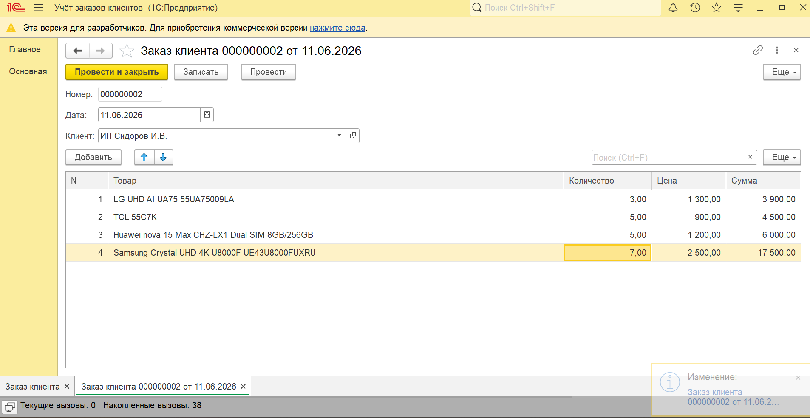
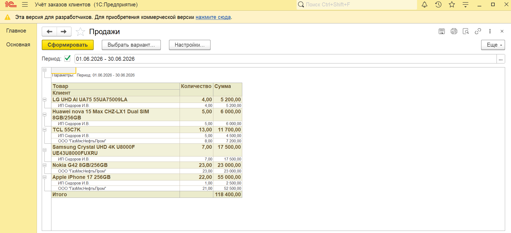
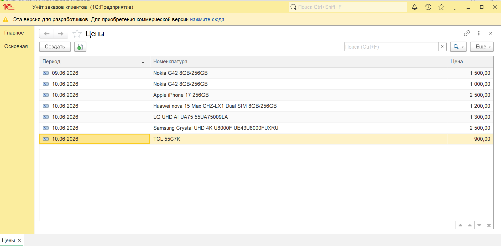

# 📦 Client Orders 1C (Заказ клиента)

Учебная конфигурация на платформе 1С:Предприятие 8.3, реализующая базовый процесс оформления заказа клиента с элементами бизнес-логики.

---

## 📌 О проекте

Проект демонстрирует навыки разработки на платформе 1С:Предприятие:

* создание документов и справочников
* работа с табличными частями
* реализация бизнес-логики
* разделение клиентского и серверного кода

Основная цель — моделирование реального процесса оформления заказа клиента.

---

## ⚙️ Реализованный функционал

* 📄 Документ **"Заказ клиента"**
* 👤 Выбор клиента
* 📦 Добавление товаров в табличную часть
* 💰 Автоматическое заполнение цены из регистра сведения
* 🧮 Расчёт суммы по строке (Количество × Цена)
* 📊 Расчёт общей суммы документа
* 🛑 Проверки перед записью:

  * заполненность клиента
  * наличие товаров
  * корректность количества
* ⚡ Проведение документа (в оборотный регистр накопления )

---

## 🧠 Архитектура и подход

В проекте реализованы базовые принципы разработки в 1С:

### 🔹 Клиентская логика

* обработка событий формы
* автозаполнение цены
* пересчёт суммы для удобства пользователя

### 🔹 Серверная логика

* проверки перед записью
* защита данных от некорректного ввода
* подготовка к проведению документа

📌 Такой подход обеспечивает:

* удобство работы пользователя
* целостность данных

---

## 🧩 Используемые объекты

* Справочник **Товары**
* Справочник **Клиенты**
* Документ **ЗаказКлиента**
* Табличная часть **Товары**
* Регистр накопления **Продажи**
* Регистр сведений **Цены**
* Отчет **Продажи**

---

## 📸 Скриншоты

### 🧾 Форма документа

### 📦 Отчет Продажи

### 📊 Регистр сведений

---

## 🚀 Как запустить

1. Открыть 1С:Предприятие
2. Загрузить файл `client-orders-1с.dt`
3. Запустить в режиме предприятия

---

## 🎯 Цель проекта

Проект создан как pet-проект для демонстрации навыков разработки на 1С и подготовки к позиции Junior 1С разработчика.

---

## 📈 Возможные улучшения

* реализация регистра накопления (учёт остатков)
* проверка наличия товаров на складе
* расширение бизнес-логики
* реализовать печатную форму
* добавить возможность загрузки фото для справочника Товары

---

## 👨‍💻 Автор

Разработчик: Евгений Антонов Junior 1С Developer
Готов к стажировке

---
